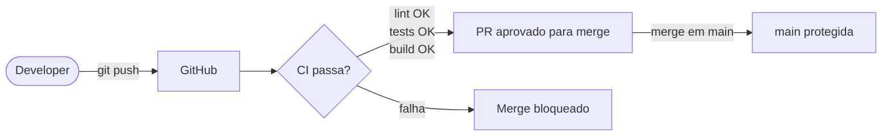

# CI/CD com GitHub Actions

## Conceito

**CI (Integração Contínua)** é a prática de automatizar a verificação do código a cada mudança — lint, testes, build — antes que chegue à branch principal. **CD (Entrega/Deploy Contínuo)** estende isso para automatizar o deploy após a CI passar.

O objetivo é detectar problemas cedo (quando o custo de correção é baixo) e garantir que `main` esteja sempre num estado deployável.

## O que foi implementado

Pipeline com 3 jobs em `.github/workflows/ci.yml`:

```
push / PR → main ou poc/**
         ├── lint      (ruff check app/)
         ├── test      (pytest tests/ -v)
         └── docker-build  (docker buildx, sem push)
```

Cada job roda em `ubuntu-latest` com Python 3.12 — mesmo ambiente do container de produção.

## Diagrama



## Decisões

| Decisão | Alternativa descartada | Motivo |
|---------|----------------------|--------|
| `ruff` para lint | `flake8` + `isort` | Ruff é ~100x mais rápido, cobre ambos |
| SQLite in-memory nos testes de CI | MySQL containerizado no workflow | Reduz complexidade do workflow; MySQL usa MySQL Actions mais pesadas |
| `docker build` sem push | Registrar imagem no GHCR | É estudo — validar build basta; push fica para POC de deploy |

## O que aprendi

- Jobs paralelos no GitHub Actions: por padrão rodam em paralelo, sem depender um do outro — ideal para lint/test/build independentes.
- `actions/checkout@v4` + `actions/setup-python@v5` são o par padrão para projetos Python.
- SQLite como banco nos testes de unidade desacopla CI de infraestrutura externa; testes de integração podem usar MySQL containerizado com `services:`.
- `docker/build-push-action` com `push: false` valida o Dockerfile sem precisar de credenciais de registry.

## Referências

- [GitHub Actions — Documentação oficial](https://docs.github.com/en/actions)
- [Ruff — Fast Python linter](https://docs.astral.sh/ruff/)
- [docker/build-push-action](https://github.com/docker/build-push-action)
- [Pytest — Getting Started](https://docs.pytest.org/en/stable/getting-started.html)
