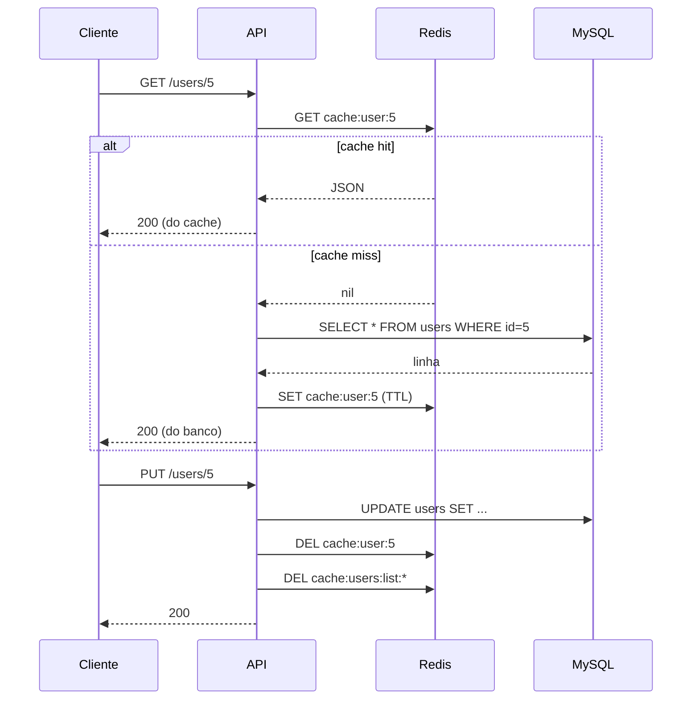

# Redis — Cache de Leitura

## Conceito

### O que é o Redis

Redis (**RE**mote **DI**ctionary **S**erver) é um banco de dados **em memória**, chave-valor, mas com estruturas de dados ricas — não só `string`. Por viver na RAM em vez de disco, uma operação simples custa microssegundos, contra os milissegundos de uma query no MySQL — é essa diferença de ordem de grandeza que o torna útil como cache: mais rápido que o banco de origem, sempre.

É single-threaded pro processamento de comandos (cada comando roda até o fim antes do próximo começar), o que elimina problemas de concorrência internos e faz cada operação individual ser atômica de graça — não precisa de lock explícito pra um `INCR` ou um `SET`, por exemplo.

Cada estrutura de dados resolve um problema diferente:

| Estrutura | Serve pra |
|-----------|-----------|
| `String` | cache simples (é o que este POC usa), contadores (`INCR`) |
| `Hash` | objetos com campos (alternativa a serializar um `string` JSON) |
| `List` | fila simples FIFO/LIFO |
| `Set` / `Sorted Set` | coleções únicas; `Sorted Set` mantém itens ordenados por score — base de ranking/leaderboard |
| `Pub/Sub` | mensageria em tempo real, não persistente (quem não está ouvindo, perde) |
| `Streams` | log de eventos persistente, mais parecido com Kafka |

### Onde se aplica (além de cache)

- **Cache** (este POC) — evita re-consultar um banco lento pra dados lidos com frequência e que toleram alguma defasagem.
- **Broker de fila de mensagens** — Celery, RQ e afins usam Redis pra enfileirar trabalho assíncrono (ver [03-filas.md](03-filas.md), que reaproveita esta mesma instância com um DB lógico separado).
- **Sessão/estado compartilhado** — guardar sessão de usuário fora do processo da API permite rodar múltiplas instâncias da API sem "sticky session" (qualquer instância atende qualquer usuário).
- **Rate limiting** — contador com TTL por IP/usuário (`INCR` + `EXPIRE`) pra limitar tentativas de login, requests por minuto etc.
- **Locks distribuídos** — coordenar acesso exclusivo a um recurso entre múltiplos processos/instâncias (`SET chave valor NX EX ttl`).
- **Leaderboard/ranking em tempo real** — `Sorted Set` mantém itens ordenados por score com inserção/consulta O(log N).

O que essas aplicações têm em comum: dado **pequeno**, **acessado com frequência**, onde perder a informação num crash não é catastrófico (por padrão Redis não é tão durável quanto um banco relacional — existe persistência opcional via RDB/AOF, mas o caso de uso típico assume que o dado pode ser reconstruído a partir da fonte de verdade, que é o banco).

### Cache-aside (o padrão usado aqui)

**Cache-aside** (lazy loading) é o padrão mais comum de cache: a aplicação primeiro consulta o cache; em caso de miss, busca no banco e grava o resultado no cache antes de responder. Escritas invalidam as chaves afetadas em vez de atualizá-las diretamente — mais simples e menos propenso a inconsistência do que manter cache e banco sincronizados em toda mutação.

O objetivo é reduzir carga no MySQL em rotas de leitura frequente, ao custo de aceitar dados potencialmente desatualizados por até `CACHE_TTL_SECONDS` (ou até a próxima escrita, que invalida na hora).

## O que foi implementado

Cache-aside em `GET /users/` e `GET /users/{id}`:

```
GET /users/{id}
  ├── cache hit  → retorna do Redis (não toca o MySQL)
  └── cache miss → consulta MySQL → grava no Redis (TTL) → retorna

POST /users/, PUT /users/{id}, DELETE /users/{id}
  └── invalida a(s) chave(s) afetada(s) no Redis antes de responder
```

Componentes:
- [app/core/cache.py](../../app/core/cache.py) — client Redis (`redis.from_url`), mesmo padrão do `engine`/`SessionLocal` em `app/db/session.py`.
- [app/api/deps.py](../../app/api/deps.py) — `get_cache()`, dependency análoga ao `get_db()`.
- [app/api/v1/users.py](../../app/api/v1/users.py) — chaves `cache:user:{id}` e `cache:users:list:{skip}:{limit}`; invalidação via `cache.delete` (chave única) e `cache.scan_iter` (padrão da listagem, já que paginação gera N chaves).

## Diagrama



## Decisões

| Decisão | Alternativa descartada | Motivo |
|---------|------------------------|--------|
| Cache-aside com invalidação | Write-through (atualizar cache na escrita) | Invalidar é mais simples e não duplica a lógica de serialização no fluxo de mutação |
| `fakeredis` nos testes | Redis real via `services:` no GitHub Actions | Mesma decisão já tomada pro banco (SQLite in-memory) — reduz complexidade do workflow, [01-cicd.md](01-cicd.md) |
| TTL curto (60s default) | TTL longo ou sem expiração | POC de estudo — TTL curto deixa o comportamento observável manualmente sem esperar muito |
| Invalidar toda a listagem (`scan_iter` + `DEL`) em qualquer mutação | Cachear só `skip=0&limit=100` (uma chave fixa) | A rota aceita paginação arbitrária; cachear por combinação de `skip/limit` é mais realista, mas exige varrer o padrão pra invalidar todas as páginas |
| `GET /users/me` fora do cache | Cachear também | `get_current_user` já consulta o banco pra autenticar o token — cachear não evitaria a query, só adicionaria complexidade |

## O que aprendi

- Dependency injection do FastAPI serve tão bem pra um client Redis quanto pra sessão do SQLAlchemy — `get_cache()` é praticamente um `get_db()` com outro backend, e isso também torna o cache trivialmente substituível por `fakeredis` nos testes via `app.dependency_overrides`.
- `response_model` do FastAPI valida a resposta independente da origem — retornar um `dict` vindo do Redis (`json.loads`) ou um objeto ORM vindo do SQLAlchemy passam pelo mesmo `UserRead`, então o cache não abre brecha pra vazar campo que o schema não expõe (ex.: `hashed_password`).
- `SCAN` (via `scan_iter`) é a forma correta de buscar chaves por padrão em produção — `KEYS *` bloqueia o Redis inteiro enquanto varre, `SCAN` itera em lotes sem travar outros comandos.
- Cache errado (não invalidado) é pior que sem cache: por isso toda mutação (`POST`/`PUT`/`DELETE`) precisa invalidar antes de responder, não só o TTL — o teste `test_list_users_serve_do_cache_apos_primeira_chamada` propositalmente muda o banco "por fora" da API pra provar que o cache é servido sem re-consultar, e os testes de `create`/`update`/`delete` prova o oposto: que a invalidação realmente acontece.

## Referências

- [Redis — Caching documentation](https://redis.io/docs/latest/develop/use/patterns/)
- [redis-py — Documentação oficial](https://redis.readthedocs.io/)
- [fakeredis — PyPI](https://pypi.org/project/fakeredis/)
- [AWS — Caching patterns (cache-aside)](https://aws.amazon.com/caching/best-practices/)
