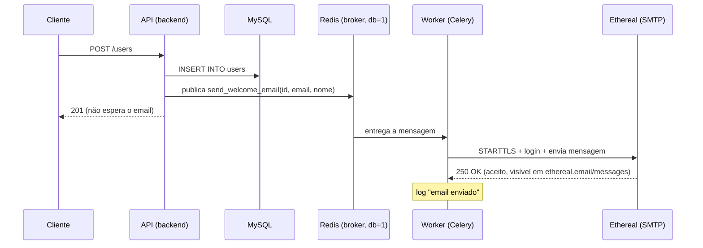

# Filas — Task Assíncrona com Celery

## Conceito

Nem toda operação de um request precisa terminar antes da resposta ir pro cliente. Quando um passo é lento e não afeta o resultado principal (enviar email, gerar thumbnail, notificar um webhook), a API pode **enfileirar** o trabalho e responder na hora — um worker separado processa a fila em paralelo, fora do ciclo request/response.

Celery é o worker: consome mensagens de um **broker** (fila de mensagens — aqui, Redis) e executa a função registrada como `@task`. A API só publica a mensagem (`.delay(...)`) e segue — não espera o resultado.

### Ethereal — SMTP de verdade, sem enviar de verdade

[Ethereal](https://ethereal.email) (mantido pelo time do Nodemailer) é um servidor SMTP real de teste: aceita a conexão, autenticação e o `DATA` do email igual a qualquer provedor — só que nunca entrega nada. O email fica visível num inbox web (`https://ethereal.email/messages`, login com o `SMTP_USER`/`SMTP_PASSWORD` da conta). É o equivalente de email pro que o `fakeredis` é pro Redis e o SQLite in-memory é pro banco: comportamento real, sem efeito colateral real.

A conta usada aqui foi criada com uma requisição `POST` pra `https://api.nodemailer.com/user` (é o mesmo endpoint que o botão "Create Ethereal Account" do site chama) — não precisa de cadastro, cada chamada gera host, porta, usuário e senha novos.

## O que foi implementado

`POST /users/` deixa de bloquear no envio do email de boas-vindas: depois do `commit`, dispara a task e responde imediatamente. A task, por sua vez, manda o email de verdade via SMTP (Ethereal) — não só loga e dorme.

```
POST /users/
  ├── cria o user no MySQL (síncrono, como sempre)
  ├── invalida cache da listagem
  ├── send_welcome_email.delay(user.id, user.email, user.full_name)  ← só publica na fila, não espera
  └── responde 201 (não espera o envio)

worker (processo separado, celery -A app.core.celery_app worker)
  └── consome a fila → conecta no Ethereal via SMTP (STARTTLS) → envia → loga sucesso
```

Componentes:
- [app/core/celery_app.py](../../app/core/celery_app.py) — instância `Celery()`, broker e result backend no Redis (`db=1`, separado do `db=0` usado pelo [cache](02-redis.md) pra não misturar chaves).
- [app/tasks/user_tasks.py](../../app/tasks/user_tasks.py) — `send_welcome_email`, task que monta a mensagem (`email.message.EmailMessage`) e envia via `smtplib.SMTP` com STARTTLS.
- [app/core/config.py](../../app/core/config.py) — `SMTP_HOST`, `SMTP_PORT`, `SMTP_USER`, `SMTP_PASSWORD`, `SMTP_FROM`.
- [app/api/v1/users.py](../../app/api/v1/users.py) — `create_user` chama `.delay(...)` em vez de executar a função diretamente.
- `worker` no [docker-compose.yml](../../docker-compose.yml) — processo Celery separado do `backend`, mesma imagem, comando diferente.

## Observabilidade

Nada aqui é mock quando roda via `docker compose up` — só nos testes (`task_always_eager` + `smtplib.SMTP` mockado, ver [Decisões](#decisões)). Formas de ver a fila funcionando de verdade:

- **Flower** (`http://localhost:5555`) — UI web oficial do Celery: lista de tasks em tempo real, estado (`SUCCESS`/`FAILURE`/`PENDING`), argumentos, resultado, tempo de execução e qual worker processou. Equivalente ao Adminer, só que pra fila em vez do banco.
- **`docker compose logs -f worker`** — o ciclo de vida de uma task aparece direto no log: `received` → log da própria função → `succeeded in Xs`.
- **`docker compose exec redis redis-cli MONITOR`** — mostra em tempo real o `LPUSH`/`BRPOP` que o Celery faz no Redis pra publicar e consumir a mensagem (mesmo Redis do [cache](02-redis.md), DB lógico diferente).

O worker roda com a flag `-E` (`--task-events`) — sem ela, o worker não publica eventos de task e o Flower fica sem dados (broker conectado, mas nenhuma task aparece).

## Diagrama



## Decisões

| Decisão | Alternativa descartada | Motivo |
|---------|------------------------|--------|
| Celery + Redis como broker | RabbitMQ | Já temos Redis rodando pro cache — reaproveitar evita subir mais um serviço só pra esse estudo |
| DB Redis separado (`db=1`) pra fila vs cache (`db=0`) | Mesmo DB pra tudo | Evita colisão entre chaves de cache e as chaves internas que o Celery usa no broker/backend |
| `task_always_eager=True` nos testes | Broker real via `services:` no GitHub Actions | Mesma decisão de [01-cicd.md](01-cicd.md) e [02-redis.md](02-redis.md) — testar sem depender de infra externa |
| `.delay()` sem aguardar resultado (fire-and-forget) | Aguardar confirmação síncrona da task | O objetivo é justamente não bloquear o request; se a API precisasse do resultado, não faria sentido ser assíncrono |
| Worker como serviço separado no compose | Rodar a task na mesma thread do backend (`BackgroundTasks` do FastAPI) | `BackgroundTasks` roda no mesmo processo da API — se o processo cair ou reiniciar (hot reload), a task se perde; um worker dedicado sobrevive a restart do backend e escala independente |
| Ethereal como SMTP | Provedor real (SendGrid, SES, Gmail) | Estudo é sobre a fila, não sobre entregabilidade de email — Ethereal dá um SMTP real (autenticação, STARTTLS, resposta do protocolo) sem risco de mandar email de verdade pra alguém |
| Mockar `smtplib.SMTP` globalmente nos testes (`autouse`) | Mockar só `.delay()` como no teste de wiring | O `task_always_eager=True` faz *qualquer* `POST /users` nos testes executar a task de verdade — sem o mock global, todo teste que cria user tentaria abrir conexão SMTP de verdade |
| Flower como serviço separado no compose | Rodar `flower` manualmente quando precisar | Serviço próprio (mesma imagem do backend) fica sempre disponível em `docker compose up -d`, igual ao Adminer pro MySQL — não é algo que se liga só quando lembra |
| `FLOWER_UNAUTHENTICATED_API=true` | Deixar a API do Flower travada (só a UI web funcionaria) | Sem essa env var o Flower retorna 401 em `/api/*` por padrão — ferramenta de dev local, sem risco em expor a API sem auth |

## O que aprendi

- `.delay(...)` é açúcar sintático pra `.apply_async(...)` — só publica a mensagem no broker, não executa nada localmente. O request nunca espera o worker.
- `task_always_eager=True` faz a task rodar *inline*, na mesma call stack de quem chamou `.delay()` — sem broker, sem worker, sem thread nova. Isso não testa "assincronia" de verdade, só testa que a task em si funciona; por isso o teste de wiring (`test_create_user_dispara_task_de_email_de_boas_vindas`) usa `mock.patch` no `.delay` pra confirmar que o endpoint *chama* a task com os argumentos certos, sem rodar a task.
- Separar o `worker` do `backend` no compose deixa claro que são dois processos independentes — dá pra escalar (`docker compose up -d --scale worker=3`) ou reiniciar um sem afetar o outro.
- `include=[...]` no `Celery(...)` é o que faz o worker descobrir a task no import — sem isso, `celery -A app.core.celery_app worker` sobe sem nenhuma task registrada.
- Porta 587 + `secure: false` no Ethereal significa submission com **STARTTLS** (conecta em texto claro, depois eleva pra TLS) — diferente da porta 465, que já é TLS implícito desde o `connect()`. `smtplib.SMTP(...).starttls()` é o par certo pra 587; `smtplib.SMTP_SSL(...)` seria o par certo pra 465.
- `docker compose logs worker` mostra o ciclo completo de uma task (`received` → log da própria função → `succeeded in Xs`) — é o jeito mais direto de confirmar que o fire-and-forget realmente rodou, já que a API não devolve esse resultado pro cliente.
- Broker conectado não é o mesmo que observável: o Flower conecta no Redis e sobe normalmente mesmo sem a flag `-E` no worker — só fica "vazio", sem nenhuma task listada, porque eventos de task (`task-received`, `task-succeeded` etc.) são publicados separadamente do payload da fila em si.

## Referências

- [Celery — First Steps with Django/FastAPI-style projects](https://docs.celeryq.dev/en/stable/getting-started/first-steps-with-celery.html)
- [Celery — Testing with pytest](https://docs.celeryq.dev/en/stable/userguide/testing.html)
- [Redis as a Celery broker](https://docs.celeryq.dev/en/stable/getting-started/backends-and-brokers/redis.html)
- [Ethereal Email](https://ethereal.email) — SMTP fake pra testes
- [Python — smtplib](https://docs.python.org/3/library/smtplib.html)
