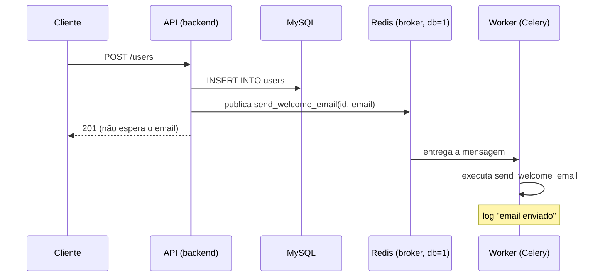

# Filas — Task Assíncrona com Celery

## Conceito

Nem toda operação de um request precisa terminar antes da resposta ir pro cliente. Quando um passo é lento e não afeta o resultado principal (enviar email, gerar thumbnail, notificar um webhook), a API pode **enfileirar** o trabalho e responder na hora — um worker separado processa a fila em paralelo, fora do ciclo request/response.

Celery é o worker: consome mensagens de um **broker** (fila de mensagens — aqui, Redis) e executa a função registrada como `@task`. A API só publica a mensagem (`.delay(...)`) e segue — não espera o resultado.

## O que foi implementado

`POST /users/` deixa de bloquear no envio do email de boas-vindas: depois do `commit`, dispara a task e responde imediatamente.

```
POST /users/
  ├── cria o user no MySQL (síncrono, como sempre)
  ├── invalida cache da listagem
  ├── send_welcome_email.delay(user.id, user.email)  ← só publica na fila, não espera
  └── responde 201 (não espera o "envio" do email)

worker (processo separado, celery -A app.core.celery_app worker)
  └── consome a fila → executa send_welcome_email → loga sucesso
```

Componentes:
- [app/core/celery_app.py](../../app/core/celery_app.py) — instância `Celery()`, broker e result backend no Redis (`db=1`, separado do `db=0` usado pelo [cache](02-redis.md) pra não misturar chaves).
- [app/tasks/user_tasks.py](../../app/tasks/user_tasks.py) — `send_welcome_email`, task que simula o envio (log + `sleep`) e retorna uma confirmação.
- [app/api/v1/users.py](../../app/api/v1/users.py) — `create_user` chama `.delay(...)` em vez de executar a função diretamente.
- `worker` no [docker-compose.yml](../../docker-compose.yml) — processo Celery separado do `backend`, mesma imagem, comando diferente.

## Diagrama



## Decisões

| Decisão | Alternativa descartada | Motivo |
|---------|------------------------|--------|
| Celery + Redis como broker | RabbitMQ | Já temos Redis rodando pro cache — reaproveitar evita subir mais um serviço só pra esse estudo |
| DB Redis separado (`db=1`) pra fila vs cache (`db=0`) | Mesmo DB pra tudo | Evita colisão entre chaves de cache e as chaves internas que o Celery usa no broker/backend |
| `task_always_eager=True` nos testes | Broker real via `services:` no GitHub Actions | Mesma decisão de [01-cicd.md](01-cicd.md) e [02-redis.md](02-redis.md) — testar sem depender de infra externa |
| `.delay()` sem aguardar resultado (fire-and-forget) | Aguardar confirmação síncrona da task | O objetivo é justamente não bloquear o request; se a API precisasse do resultado, não faria sentido ser assíncrono |
| Worker como serviço separado no compose | Rodar a task na mesma thread do backend (`BackgroundTasks` do FastAPI) | `BackgroundTasks` roda no mesmo processo da API — se o processo cair ou reiniciar (hot reload), a task se perde; um worker dedicado sobrevive a restart do backend e escala independente |

## O que aprendi

- `.delay(...)` é açúcar sintático pra `.apply_async(...)` — só publica a mensagem no broker, não executa nada localmente. O request nunca espera o worker.
- `task_always_eager=True` faz a task rodar *inline*, na mesma call stack de quem chamou `.delay()` — sem broker, sem worker, sem thread nova. Isso não testa "assincronia" de verdade, só testa que a task em si funciona; por isso o teste de wiring (`test_create_user_dispara_task_de_email_de_boas_vindas`) usa `mock.patch` no `.delay` pra confirmar que o endpoint *chama* a task com os argumentos certos, sem rodar a task.
- Separar o `worker` do `backend` no compose deixa claro que são dois processos independentes — dá pra escalar (`docker compose up -d --scale worker=3`) ou reiniciar um sem afetar o outro.
- `include=[...]` no `Celery(...)` é o que faz o worker descobrir a task no import — sem isso, `celery -A app.core.celery_app worker` sobe sem nenhuma task registrada.

## Referências

- [Celery — First Steps with Django/FastAPI-style projects](https://docs.celeryq.dev/en/stable/getting-started/first-steps-with-celery.html)
- [Celery — Testing with pytest](https://docs.celeryq.dev/en/stable/userguide/testing.html)
- [Redis as a Celery broker](https://docs.celeryq.dev/en/stable/getting-started/backends-and-brokers/redis.html)
