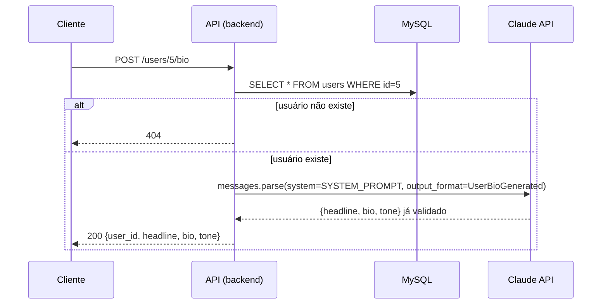

# Engenharia de Prompt — Bio Gerada por IA no Perfil do Usuário

## Conceito

### O que é engenharia de prompt

Engenharia de prompt é o design deliberado da entrada que um LLM recebe — instrução de sistema, formato de saída, exemplos — pra reduzir a variância da resposta e aumentar a chance de ela ser útil e no formato certo. Não é sobre "pedir direito", é sobre tratar o prompt como parte da interface do sistema, com o mesmo cuidado que se trata um contrato de API.

| Técnica | O que resolve |
|---------|----------------|
| **System prompt** | Define papel, restrições e formato antes de qualquer entrada do usuário — separa "quem o modelo é" de "o que foi pedido" |
| **Output estruturado** (`output_format` com schema Pydantic) | Garante que a resposta é JSON válido no formato esperado, sem parsing manual nem regex sobre texto livre |
| **Campo `Literal`/enum no schema** | Restringe não só o formato, mas o *conjunto de valores* possíveis de um campo — o modelo não pode inventar uma categoria fora da lista |
| **Few-shot embutido no prompt** | Uma amostra de entrada/saída dentro do próprio `system`, ancorando tom e tamanho sem precisar de um turno extra de mensagem |

### Por que output estruturado em vez de texto livre + parsing

A alternativa óbvia — pedir "responda em JSON" e fazer `json.loads()` na resposta — quebra sempre que o modelo decora a resposta com texto antes/depois do JSON, ou erra uma vírgula. `client.messages.parse(..., output_format=Schema)` elimina essa classe de erro: a API garante que o primeiro bloco de texto é JSON válido que valida contra o schema, e devolve o objeto já parseado em `response.parsed_output`.

## O que foi implementado

Um endpoint novo, `POST /users/{id}/bio`, que gera uma bio curta e estruturada pro usuário a partir do nome/email já cadastrado — sem persistir nada, gerada sob demanda a cada chamada.

```
POST /users/{id}/bio
  ├── busca o user no MySQL (404 se não existir)
  ├── generate_user_bio(user) → chama a Claude API com system prompt + schema Pydantic
  └── responde 200 com {user_id, headline, bio, tone}
```

Componentes:
- [app/core/llm.py](../../app/core/llm.py) — cliente `anthropic.Anthropic()` instanciado uma vez no import (mesmo padrão de [app/core/cache.py](../../app/core/cache.py)), `SYSTEM_PROMPT` com regras + exemplo embutido, e `generate_user_bio(user)` que chama `messages.parse(...)`.
- [app/schemas/user.py](../../app/schemas/user.py) — `UserBioGenerated` (o que o modelo gera: `headline`, `bio`, `tone: Literal[...]`) e `UserBioRead` (adiciona `user_id`, é o `response_model` do endpoint).
- [app/api/v1/users.py](../../app/api/v1/users.py) — `generate_bio`, reaproveitando o `RESPONSES` dict e o padrão de autenticação/log já usados nos outros endpoints do router.
- [app/core/config.py](../../app/core/config.py) — `ANTHROPIC_API_KEY` (obrigatória) e `ANTHROPIC_MODEL` (default `claude-opus-5`).

## Diagrama



## Decisões

| Decisão | Alternativa descartada | Motivo |
|---------|------------------------|--------|
| `claude-opus-5` como modelo | Um modelo mais barato (ex.: Haiku) | Modelo padrão pra qualquer nova integração com a Claude API, salvo pedido explícito de outro — mantém a implementação alinhada com a orientação vigente pra código novo |
| Output estruturado via `messages.parse(output_format=...)` | Prompt "responda em JSON" + `json.loads()` manual | Elimina parsing frágil — a API garante que a resposta valida contra o schema Pydantic antes de chegar no `response.parsed_output` |
| `tone` como `Literal["formal", "casual", "tecnico"]` | `tone: str` livre | Restringe não só o formato, mas o conjunto de valores — o schema é o contrato, não só uma sugestão |
| Few-shot embutido no `system`, sem turno extra de mensagem | Par de mensagens user/assistant de exemplo antes da pergunta real | Mais simples de manter, e suficiente pra ancorar tom/tamanho num caso de uso pequeno como esse |
| Sem persistência (bio não é salva no `User`) | Adicionar coluna `bio` no modelo | Este projeto não tem Alembic — qualquer coluna nova só pega em tabela recriada (`docker compose down -v`, mudança quebrando). Persistência é modelagem de dados, um item separado do roadmap; aqui o foco é só o prompt em si |
| Sem `try/except` ao redor da chamada da Claude API | Capturar exceção e devolver 502/503 customizado | Mesma escolha que `send_welcome_email` já faz com o SMTP — falha externa sobe como 500 pelo handler padrão do FastAPI, sem guarda extra |
| `ANTHROPIC_API_KEY` obrigatória, sem default | Tornar opcional com fallback silencioso | Mesmo padrão de `SMTP_USER`/`SMTP_PASSWORD` — o projeto já assume que falta de credencial real impede o app de subir, não esconde o problema atrás de um default |

## O que aprendi

- `messages.parse()` com `output_format=<Pydantic model>` resolve o mesmo problema que o resto do projeto resolve com `response_model` do FastAPI — os dois são "o schema é o contrato, não uma sugestão", só que um valida o que sai da API e o outro valida o que sai do modelo de IA.
- Este é o primeiro POC do PDI com custo real por chamada — Redis, RabbitMQ e MySQL são infra local, Ethereal é SMTP fake, mas a Claude API cobra por token. Isso mudou como os testes foram desenhados: `generate_user_bio` é mockada por inteiro nos testes (`patch("app.api.v1.users.generate_user_bio", ...)`), então `pytest` nunca gasta crédito, só o teste manual documentado abaixo gasta.
- Mockar a função inteira (em vez de mockar só o cliente HTTP por baixo) é mais simples e mais estável: o teste não depende de conhecer o formato exato da resposta do SDK, só do contrato que `generate_user_bio` promete (devolver um `UserBioGenerated`).
- Um exemplo de entrada/saída dentro do próprio `system` prompt (few-shot) é a forma mais barata de ancorar formato e tom — não precisa de um turno de mensagem extra nem de lógica de montagem de few-shot dinâmico pra um caso pequeno como esse.

## Teste manual (opcional, gasta créditos reais)

Só funciona depois de colocar uma `ANTHROPIC_API_KEY` de verdade no `.env` (e reiniciar o `backend`):

```bash
TOKEN=$(curl -s -X POST http://localhost:8000/api/v1/auth/login \
  -H "Content-Type: application/json" \
  -d '{"email":"admin@local.dev","password":"admin123"}' \
  | python -c "import sys,json; print(json.load(sys.stdin)['access_token'])")

curl -X POST http://localhost:8000/api/v1/users/1/bio \
  -H "Authorization: Bearer $TOKEN"
```

## Referências

- [Claude — Structured outputs](https://platform.claude.com/docs/en/build-with-claude/structured-outputs)
- [Claude — System prompts](https://platform.claude.com/docs/en/build-with-claude/prompt-engineering/system-prompts)
- [Anthropic — Python SDK](https://github.com/anthropics/anthropic-sdk-python)
- [Claude — Model overview](https://platform.claude.com/docs/en/about-claude/models/overview)
